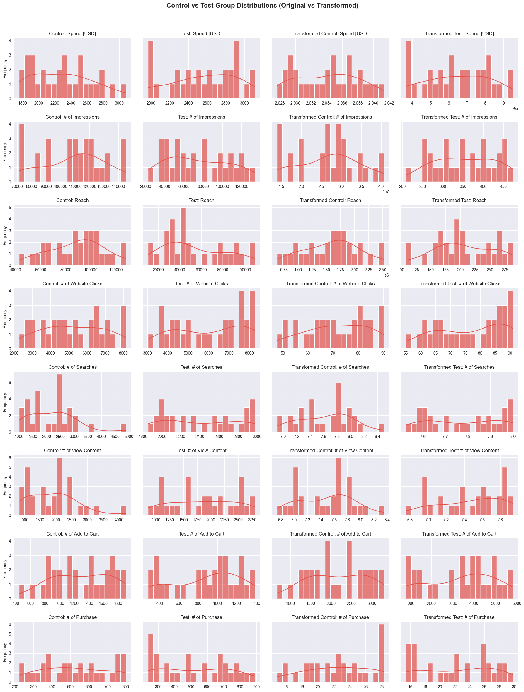

# A/B Testing on Marketing Campaign Performance

## Project Overview

A/B testing, also known as split testing, is a statistical method used to compare two variations of a marketing strategy to determine which one performs better. This project aims to analyze the effectiveness of a new marketing campaign compared to an existing one by evaluating key performance metrics such as Click-Through Rate (CTR) and Conversion Rate (CVR).

**Dataset:** [A/B Testing Dataset - Kaggle](https://www.kaggle.com/datasets/amirmotefaker/ab-testing-dataset)

## Objective

The goal of this A/B test is to determine whether the new marketing strategy results in:

- Higher **Click-Through Rate (CTR)** (proportion of users who click on ads after seeing them).
- Higher **Conversion Rate (CVR)** (proportion of users who make a purchase after clicking on an ad).

## Methodology

### 1. Data Preprocessing

- Load and clean the dataset.
- Compute key metrics: CTR and CVR.
- Handle missing values and normalise data if necessary.

### 2. Exploratory Data Analysis (EDA)

- Visualise the distribution of key metrics.
- Identify patterns or anomalies.

### 3. Statistical Testing

- Perform normality tests (Shapiro-Wilk).
- Check variance equality (Levene’s test).
- Select appropriate statistical tests (T-test or Mann-Whitney U test).
- Compare CTR and CVR between the Control and Test groups.

### 4. Time Series Analysis

- Track changes in CTR and CVR over time for both groups.
- Detect trends or anomalies.

### 5. Funnel Analysis

- Visualise user drop-off rates through different marketing funnel stages.

## Key Findings

- The **CTR significantly increased** in the test group, suggesting that the new marketing strategy was more effective in attracting clicks.
- However, **CVR did not show a significant improvement**, indicating that while more users clicked on the ad, they did not necessarily convert to purchases.
- A deeper look into the funnel analysis suggests potential optimisation opportunities at the later stages of the customer journey.

## How to Run This Project

### **Requirements**

- Python 3.x
- Jupyter Notebook
- Libraries: `pandas`, `numpy`, `scipy`, `matplotlib`, `seaborn`

### **Instructions**

1. Clone this repository.
2. Install the necessary dependencies using `pip install -r requirements.txt`.
3. Open `AB_testing.ipynb` in Jupyter Notebook.
4. Run all the cells to perform the analysis.

## Future Improvements

- **Segment Analysis:** Analyse A/B test results based on user demographics.
- **Multivariate Testing:** Extend the analysis to test more than two variations.
- **Predictive Modeling:** Use machine learning to predict user behavior and optimise marketing strategies.

## Conclusion

This analysis demonstrates the power of A/B testing in evaluating marketing strategies. While the new campaign increased engagement (CTR), further refinements are needed to improve conversion rates.

## License

MIT License

## Contact

For questions and suggestions, reach out via [LinkedIn](https://www.linkedin.com/in/bekhruzsuleymanov/).
